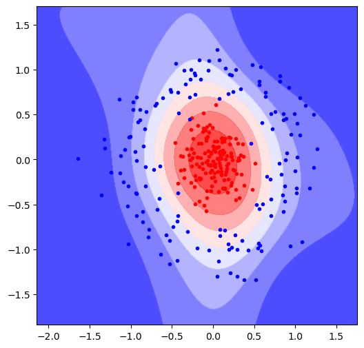

# MLP From Scratch

A lightweight, object-oriented implementation of a Multi-Layer Perceptron (MLP) built entirely from scratch using Python and NumPy. This project demonstrates the inner workings of neural networks, including forward propagation, backpropagation, and gradient descent, without relying on deep learning frameworks like TensorFlow or PyTorch.

## Project Structure

* **`mlp.py`**: Contains the main `MLP` class which orchestrates the network creation, training loop, and prediction.
* **`Unit.py`**: Defines the building blocks of the network:
* `InputUnit`: Handles input features.
* `NeuralUnit`: Represents a single neuron (weights, bias, Sigmoid activation, gradient calculation).
* `Loss`: Handles the binary cross-entropy loss calculation.

* **`Experiment.ipynb`**: A Jupyter Notebook demonstrating how to use the library to solve a binary classification problem (using the `make_circles` dataset).

## How it Works

1. **Initialization**: The network is built layer by layer. `NeuralUnit`s are plugged into the preceding layer's units.
2. **Forward Pass**: Data flows from `InputUnit`s through `NeuralUnit`s (performing ) to the `Loss` unit.
3. **Loss Calculation**: The network uses a Log Loss (Binary Cross-Entropy) logic for binary classification.
4. **Backpropagation**: Error terms (`deltas`) are propagated backward from the Loss unit through the network using the chain rule.
5. **Update**: Weights and biases are updated using the calculated gradients and the learning rate ().

## Example Results

Using the `Experiment.ipynb`, the network successfully separates non-linearly separable data (concentric circles) after training.

